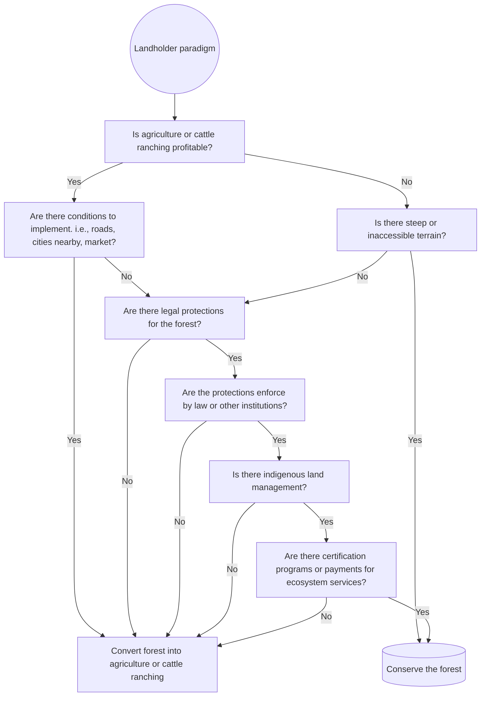
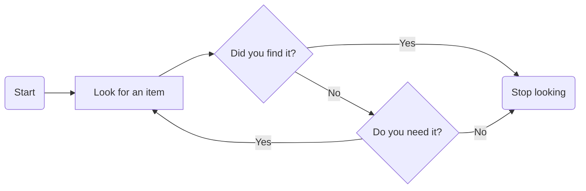
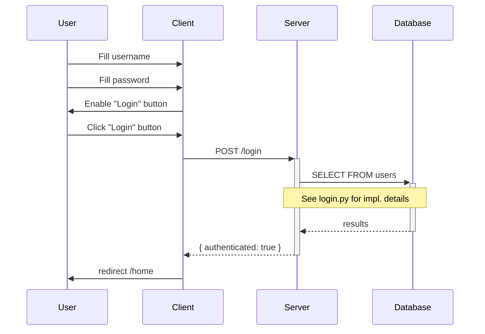

# A New Meta-Analysis of the Drivers of Deforestation

Deforestation is one of the main environmental problems facing the world today. The loss of tropical forests has serious consequences for biodiversity, climate, and human well-being. But what factors cause deforestation and how can it be stopped?

In a recent study published in the *Review of Environmental Economics and Policy*¹, the researchers Kalifi Ferretti-Gallon and Jonathan Busch conducted a comprehensive analysis of more than 15,000 data points from 320 published studies between 1996 and 2020, to identify the factors that are consistently associated with more deforestation, less deforestation, or neither.

## The Main Drivers of Deforestation

Their meta-analysis revealed that deforestation is driven mainly by **agriculture and cattle ranching**, **road construction**, **urban expansion**, and **population growth**. These factors increase the demand and access to land, reduce the opportunity cost of conserving forests, and facilitate the conversion of forests into other uses.

Agriculture and cattle ranching are the most important factors, as they account for 80% of global deforestation². The expansion of the agricultural frontier is due to both the production of food for local consumption and the production of commercial crops for export, such as soy, palm oil, and cocoa.

Road construction is another key factor, as it facilitates access to forest areas, both for legal and illegal purposes. Roads also attract other actors, such as settlers, loggers, and miners, who contribute to deforestation and forest degradation.

Urban expansion and population growth also exert pressure on forests, by increasing the demand for land, resources, and services. In addition, urbanization reduces the dependence of local populations on forests for their livelihood, which decreases their incentive to protect them.

## The Main Factors that Halt Deforestation

Their meta-analysis also identified some factors that are associated with less deforestation or even with the increase of forest cover. These factors are **steeper and less accessible terrain**, **stronger protections for parks and reserves**, **indigenous land management**, **product certification programs**, and **payments for ecosystem services**.

Steeper and less accessible terrain reduces the profitability and feasibility of converting forests into other uses, by increasing the transportation and production costs. This makes forests more valuable in their natural state, as providers of ecosystem services.

Stronger protections for parks and reserves are essential to prevent deforestation, by establishing legal and physical boundaries for land use. However, these protections must be effective and enforced, which requires financial, human, and institutional resources.

Indigenous land management is another factor that contributes to forest conservation, by recognizing the rights and knowledge of local populations that depend on forests for their culture, identity, and livelihood. Indigenous peoples usually have a long-term vision and an ethic of care for forests, which is reflected in lower deforestation rates in their territories.

Product certification programs are voluntary initiatives that seek to promote more sustainable and responsible agricultural practices, by setting social and environmental standards for the production and trade of certain products. These programs can reduce deforestation by incentivizing producers to improve their land management, avoid forest conversion, and respect the rights of local communities.

Payments for ecosystem services are mechanisms that reward landowners or users for conserving or restoring forests, by recognizing the value of the benefits that forests provide to society, such as carbon sequestration, climate regulation, and water provision. These mechanisms can decrease deforestation by increasing the value of standing forests and compensating the opportunity cost of not converting them into other uses.

## A Resource to Guide Models of Future Deforestation in projects

Their study is the first to conduct such a broad and rigorous meta-analysis on the drivers of deforestation. Below, I present a decision tree diagram to illustrate a decision-making process related to the topic. The diagram shows how an actor or landowner can choose between different land use options, taking into account the factors that drive or halt deforestation.

---

¹: Ferretti-Gallon, K. and Busch, J. (2024). What Drives Deforestation and What Stops It? A Meta-Analysis. *Review of Environmental Economics and Policy*, 8(1), 3-23. [Article](^1^).

²: FAO (2020). *The State of the World's Forests 2020*. Rome: Food and Agriculture Organization of the United Nations. [Report](^2^).